# E-Commerce website using MERN Stack

## Technologies used 
1. HTML
2. CSS
3. JavaScript
4. React

- Node JS, Express JS and MongoDb is used for Backend server.

## Configuration and Setup

In order to run this project locally, simply fork and clone the repository or download as zip and unzip on your machine.

- Open the project in your prefered code editor.
- Go to terminal -> New terminal (If you are using VS code)

In the terminal
- cd client
- Set environment variables in .env file in src folder
```
#  ---  .env  ---

REACT_APP_API= (like : http://localhost:8080)

```
```
# --- Terminal ---
$ cd client
$ npm install (to install frontend-side dependencies)
```
- Come to root directory and Set environment variables in .env file
- Create your mongoDB connection url, which you'll use as your MONGO_URL (MongoDB URI)
- Using braintree make an account and link to paypal for payment integration and provide your Merchant ID, Public Key and Private Key
- Supply the following credentials

```
#  ---  .env  ---

PORT= (like : 8080)
MONGO_URL=
JWT_SECRET= 
BRAINTREE_MERCHANT_ID = 
BRAINTREE_PUBLIC_KEY = 
BRAINTREE_PRIVATE_KEY = 

```


```
# --- Terminal ---
$ cd .. (come to root directory)
$ npm install (to install backend-side dependencies)
$ npm run dev (to start the backend and frontend concurrently)
```

##  Key Features

1. User Authentication (Register, Login and Logout)
2. Proper Landing page with Recent Products
3. Product Listing Page
4. Sort and filter products
   - Filter using Minimum and Maximum Price Range
   - Filter by Products Categories
   - Clear all filters
5. Cart Management 
   - Add to cart  
   - Remove from cart
7. Single Product Page
8. Order Summary of the ordered items
9. Custom Toast Component with 4 types - Success, Error, Warning and Information
10. PayPal payment Integration
11. Orders page
12. Search bar to search products by name and description 
13. Pagination

## Screenshots
## Home Page

<div style="text-align: center;">
  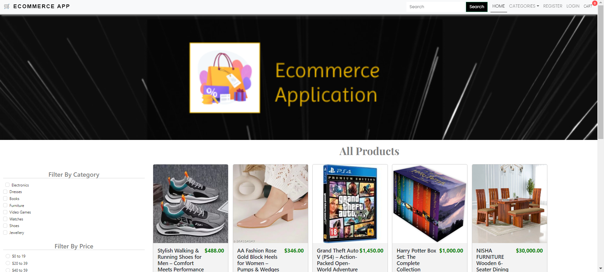
  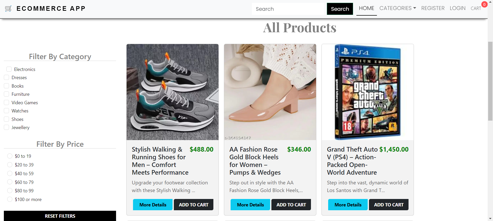
</div>

## Category Page

<div style="text-align: center;">
  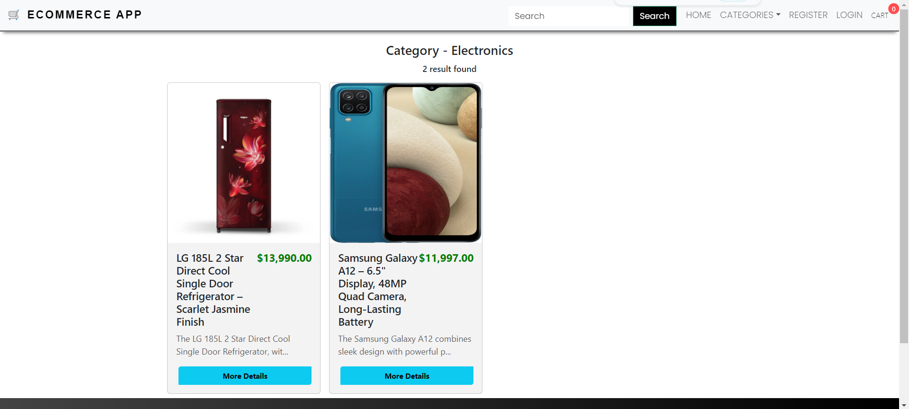
</div>

## Registration Form

<div style="text-align: center;">
  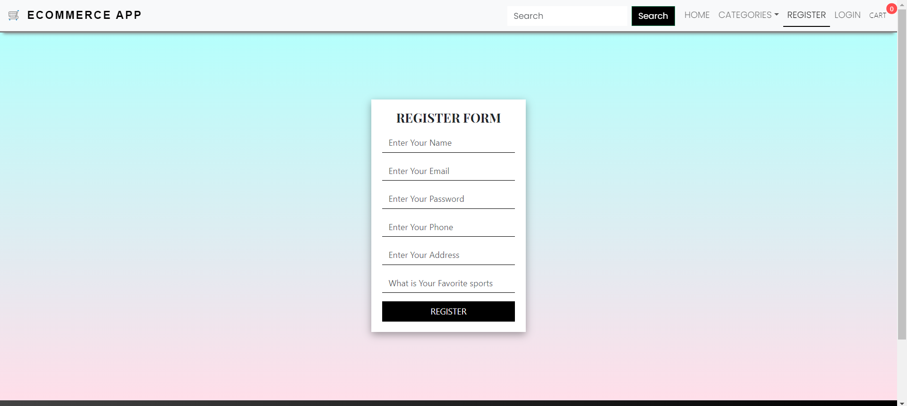
</div>

## Login Form

<div style="text-align: center;">
  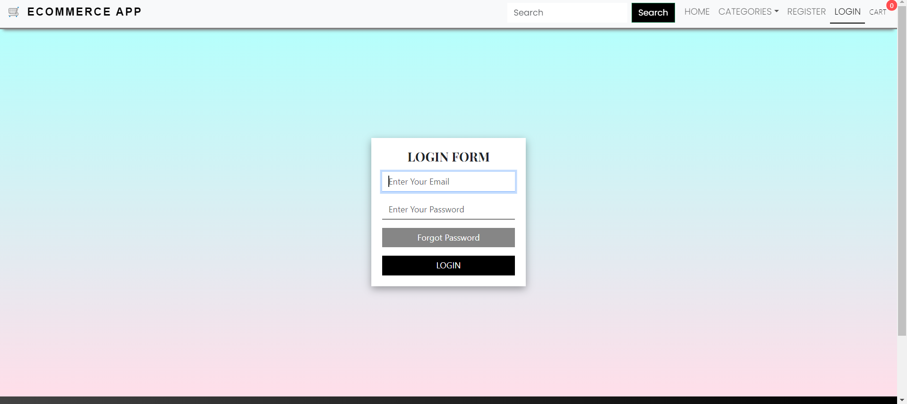
</div>

## Users Dashboard

<div style="text-align: center;">
  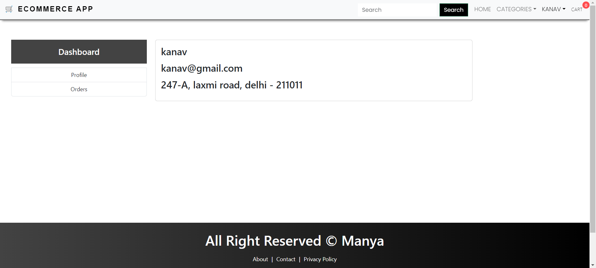
</div>

## User Profile Page

<div style="text-align: center;">
  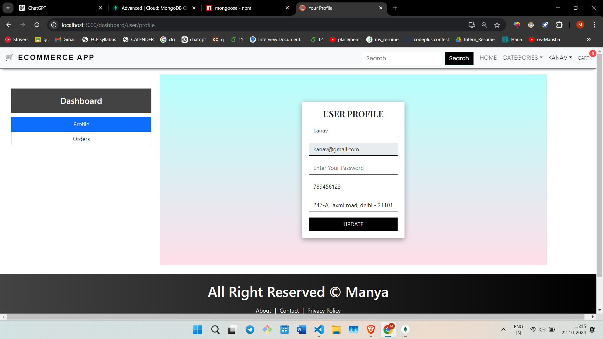
</div>

## Cart

<div style="text-align: center;">
  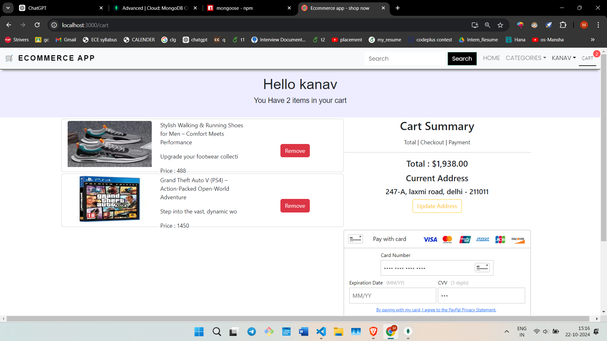
</div>

## About Page

<div style="text-align: center;">
  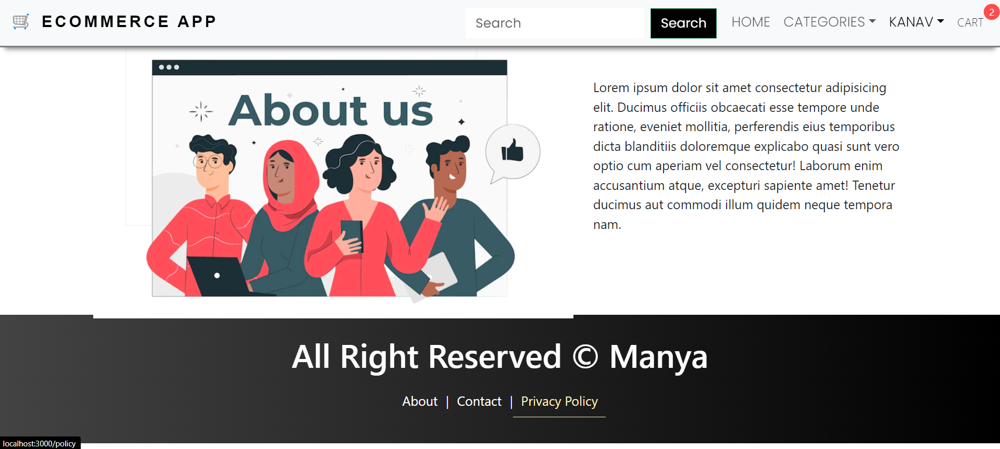
</div>

## Contact Us Page

<div style="text-align: center;">
  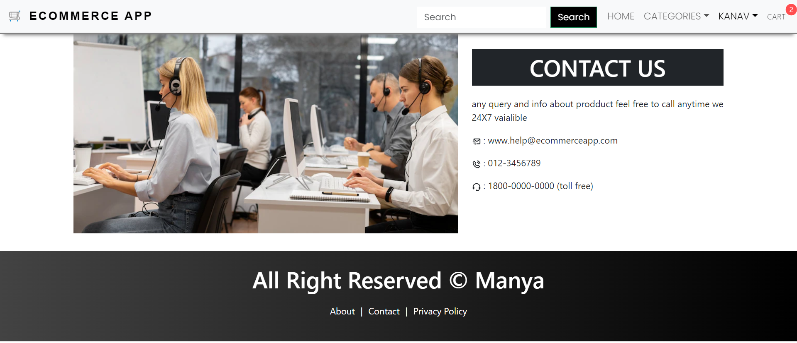
</div>

## Policy Page

<div style="text-align: center;">
  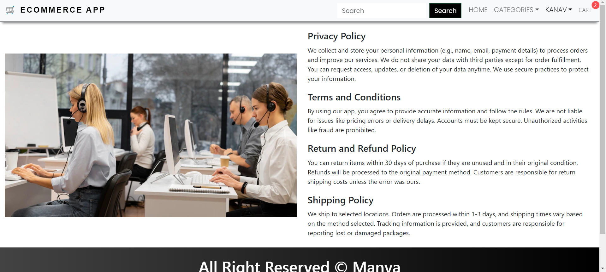
</div>
